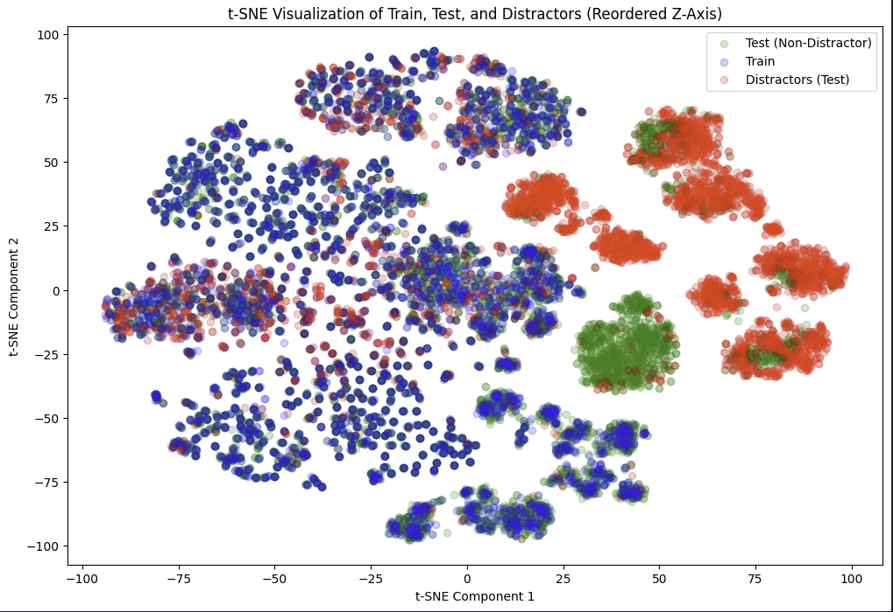

# Report: UCU Computer Vision HW 4

## Task

Identify around labels in test set of images, consisting of 1k classes, and 13k samples on test set and around 3k on train set. \
Test set has no labels, just images, whilst train set has labels.
We'd need to train models using semi-supervised, metric, self-supervised technics. As well as to do a pre-trained model inference. \

## Notebooks and code structure

The notebooks and code is as follows:
- `ucu-cv-hw-4-metric-learning-clip.ipynb` our notebook for metric learning approach, using `openai/clip-vit-base-patch32` backbone and small embedding layer (512 neurons) on top
- `ucu-cv-hw-4-pretrained-inference-clip-e-2-e.ipynb` our notebook for pre-trained approach, using `openai/clip-vit-base-patch32` for Embeddings, DBScan and TSNE for Distractor filtering, and Cosine Similarity for Label Prediction (best score)
- `ucu-cv-hw-4-pretrained-inference-clip-xgboost.ipynb` our notebook for pre-trained approach, using `openai/clip-vit-base-patch32` for Embeddings, DBScan and TSNE for Distractor filtering, and XGBoost for Label Prediction
- `ucu-cv-hw-4-self-supervised-simclr-clip.ipynb` our notebook for self-supervised approach, using `openai/clip-vit-base-patch32` and SimCLR models.

## Submissions and results

| Submission and Description                              | Private Score | Public Score | Selected for leaderboard |
|---------------------------------------------------------|---------------|--------------|--------------------------|
| Metric-Learning CLIP - 100 epochs (late submission)     | 0.19095       | 0.19422      |                          |
| Metric-Learning CLIP - 20 epochs (late submission)      | 0.18457       | 0.18533      |                          |
| Metric-Learning CLIP - 5 epochs                         | 0.17030       | 0.17772      |                          |
| Self-Supervised CLIP + SimCLR - 10 epochs               | 0.13544      | 0.14187      |                          |
| Self-Supervised CLIP + SimCLR - 100 epochs              | 0.09293      | 0.10277      |                          |
| Pre-Trained Inference CLIP + DBScan + XGBoost           | 0.45814       | 0.45247      | ✅                        |
| **Pre-Trained Inference CLIP + DBScan + Cosine Similarity** | **0.78722**       | **0.78440**      | ✅                        |

The Pre-Trained Inference CLIP + DBScan + Cosine Similarity, my first submission resulted in the greatest score from all variants.\
In my opinion, it's an expected behavior considering the following:
- There's a train-to-test disbalance, we have less train samples, than the test set (3k vs 13k respectfully). \
This results in a limitation and a skew from the standpoint of a limited data we can learn and generalize to the test set.
It'd take long, or need a lot of effort, i.e. a lot more than 100 epochs for metric or self-supervised learning methods, to surpass that result.
- Why it's better than training? That is because we heavily utilize the vast generalization ability of the CLIP model, which is pre-trained, and the cosine similarity from the test set. \
As we'll see later on at EDA section, the embeddings provided by CLIP model are sufficiently good not only to classify an example in test set, but also to do a post-processing on them, and confidently filter the distractors.
- Distractor filtering using DBScan, as mentioned, if'd take a look at the embeddings representations from CLIP, it's clear that the distractors are nothing but a new classes provided in the test set. That entails the following: \
if we have a reasonably good embeddings and dimensionality reduction mechanizm, we'd be able to classify the distractors with very high confidence.
- The approach with DBScan wouldn't work if distractors would be the same classes from train set, but having too much distortions, i.e. distance is high, but they do not form apparent clusters/

## EDA


I've started doing this homework from the pre-trained model inference part, so most of my EDA findings, come from the **Pre-trained Inference: Clip E2E part.
Also, there's 3 samples per label in train set. So the dataset is uniformly distributed, with little to learn from the train set without a model with superb generalization knowledge. \
I.e. if model already knows those classes well, and needs a little tuning. But as we'd see later, it's problematic with limited training time for other methods involving optimization (training) 

## Pre-Trained Inference: Clip E2E

### Distractors: 30% of expected dataset contaminations

Using a linear space search and try-and-fail method, I've discovered that there's 30% of expected distractors in the test dataset.\
By so, expecting 30% of contamination rate, I've selected a corresponding threshold (0.78) value found by linear space search\
This threshold is a similarity threshold, for a cosine similarity method, to determine distractors. 


### Distractors Filtering: Cosine Similarity



Using a cosine similarity search, we've found distractors (in red) as samples having less than 0.78 normalized cosine similarity score from train set.

### Distractor Filtering: DBScan

Then, I've noticed that there's apparent clusters of distractors as mentioned earlier, so I've decided to use clusterization method to identify outliers in test set.\
A perfect method for this is DBScan, results are down below:


Maybe the result is not ideal, since we can clearly see that some of the samples from test set, from the clusters which were identified by DBSCAN as distractors, in my opinion it looks conceptually better than simple cosine similarity approach. However, there could be more (although I suppose not many) samples just different from the train dataset, but I doubt they are actually distactors in their nature, but less simmilar examples of classes present in the train dataset.

### Predictions and Results

The method for predictions is fairly simple, given a test sample we find top-5 nearest samples using cosine similarity from the train set. If the sample is classified as distractor (By DBScan), we prepend -1 score and do top-4 classification after that.
So, the predictions would have a following form, as requested in competition:


As you can see distractors (last 5 samples) are classified with -1 score, and other possible classes coming next.

Clip E2E model with preprocessor from `openai/clip-vit-base-patch32` resulted in a fairly good prediction, considering our little technical investment in this approach: 0.79 on both private and public scores. 

## Pre-Trained Inference: Clip E2E + XGBoost

I was also interested in using a training on the embeddings we've received for test and train sets, so, I trained an XBBoost model to classify labels. \
My main idea here was to prioritize generalization, so I've created a validation set with a sample per class, so now we'd have 2 samples in train per class, and 1 in validation set from train.
The intend behind the validation class is to provide us with early stopping, as our test set is skewed in terms of its size, which is not in our favor. \
I.e. we'd want the model to have a good generalization ability to not overfit on a small train dataset; hence, we use early stopping mechanizm. \
However, as we've seen in the scores table: Pre-Trained Inference CLIP + DBScan + XGBoost resulted in 0.45 top5 score in both private and public leaderboards, not an improvement from regular cosine similarity classification, which resulted in 0.79 score

## Metric-Learning: Clip Model

The Metric-Learning approach ranked second to Pre-Trained Inference scores but was computationally expensive and slow to train. Here's how embeddings evolved over different epochs:
10 epochs:

100 epochs:

200 epochs:


Scores improved slightly with more training but at a slow pace. For example, the mAP@5 score went from 0.17 to 0.19 over 200 epochs with the following configuration: (2 points)
```python
CONFIG = {
    "batch_size": 32,
    "epochs": 200,
    "lr": 1e-4,
    "margin": 1.0,  # For triplet loss
    "embedding_dim": 128
}
```
Given more time, experimenting with more epochs (e.g., 2k), learning rate adjustments, or schedulers could boost results. Despite slow progress, this method showed consistent convergence, unlike the Self-Supervised approach, which degraded over time, possibly due to implementation issues.

### Metric Learning Summary

Metric learning, using a triplet loss, trains a model to map similar images closer and push dissimilar ones farther in the embedding space. With a fine-tuned CLIP vision backbone and projection head, the approach showed gradual improvement, but progress was slow and training computationally intensive. For instance, the mAP@5 score only increased from 0.17 to 0.19 after 200 epochs. More epochs, tuning learning rates, or adding schedulers might yield better results, but the current setup demonstrates steady, if slow, convergence.

## Self-Supervised: Clip + SimCLR

The Self-Supervised approach combines the CLIP vision backbone with SimCLR training to learn embeddings without explicit labels. While this method is designed to generalize from the data itself, it faced challenges in this setup. 

Despite training for 100 epochs, the embeddings did not exhibit meaningful clustering or alignment with the dataset's structure. As seen in the t-SNE visualization below, the embeddings lacked clear separation, indicating difficulty in distinguishing classes effectively:


This issue is reflected in the mAP@5 scores, which decreased with more training. Starting at 0.14 after 10 epochs, the score dropped to 0.10 after 100 epochs. This performance degradation suggests potential issues in implementation, optimization, or a fundamental misalignment between the method and the dataset's properties.

Future improvements could involve:
- Enhancing data augmentation techniques to create more robust representations.
- Adjusting the temperature parameter or adding a more sophisticated projection head.
- Experimenting with different architectures or using a hybrid approach combining supervised and self-supervised methods.

While promising in theory, the Self-Supervised approach did not achieve competitive results within the constraints of this task.


## Conclusions

## Summary

Four approaches were tested for the task:

1. **Pre-Trained Inference (CLIP + Cosine Similarity)**: Achieved the best results with an mAP@5 score of 0.79 by using pre-trained CLIP embeddings and cosine similarity for classification. This approach required no training and leveraged CLIP’s generalization ability effectively.

2. **Metric Learning (CLIP + Triplet Loss)**: Showed consistent improvement but at a slow rate, reaching an mAP@5 score of 0.19 after 200 epochs. It required significant computational resources and more training time to potentially improve further.

3. **Self-Supervised Learning (CLIP + SimCLR)**: Performed poorly, with the mAP@5 dropping from 0.14 to 0.10 after 100 epochs. Results suggest issues in optimization or a mismatch between the method and dataset.

4. **Pre-Trained Inference + XGBoost**: Combined CLIP embeddings with XGBoost but achieved only 0.45 mAP@5, which was lower than cosine similarity.

The Pre-Trained Inference with cosine similarity was the most effective and efficient method for this task.

But, if I've had more time, I'd explore self-supervised learning approach as mentioned during our practice lesson, it takes a lot of time to train it and achieve meaningful results.

